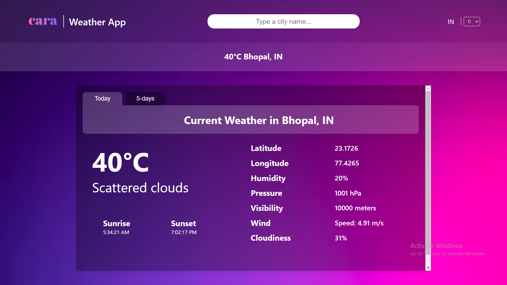

<h2 align="center">
  Weather App - 
  <a href="https://mridul-weather-app.vercel.app/" target="_blank">Live Demo</a><br /><br />
  <p>Stay updated with the latest weather information!</p>
</h2>

<div align="center">
  
</div>

## Table of Contents

- [Introduction](#introduction)
- [Technologies Used](#technologies-used)
- [Features](#features)
- [Installation](#installation)
- [Usage](#usage)
- [API](#api)
- [Contributing](#contributing)
- [License](#license)
- [Contact](#contact)
- [Show Your Support](#show-your-support)

## Introduction

Welcome to the Weather App! This application allows you to search for and view weather information for any city. It displays current weather data and supports both Celsius and Fahrenheit temperature units. Enjoy a responsive design for an optimal user experience across all devices.

## Technologies Used

This project was built using these technologies:

- React.js
- Axios
- OpenWeather API
- CSS3
- VsCode
- Vercel

## Features

- Search for weather by city name.
- Display weather details including temperature, humidity, and weather conditions.
- Switch between Celsius and Fahrenheit.
- Responsive design for mobile and desktop devices.
- Dynamic search bar with suggestions.

## Installation

1. Clone the repository:
    ```bash
    https://github.com/mridul0703/Weather-App.git
    cd Weather-App
    ```

2. Install dependencies:
    ```bash
    npm install
    ```

3. Start the development server:
    ```bash
    npm start
    ```

## Usage

- Open the app in your browser: `http://localhost:3000`
- Use the search bar to enter a city name and view its weather information.
- Switch between Celsius and Fahrenheit using the dropdown menu.

## API

This application uses the [OpenWeather API](https://openweathermap.org/api) to fetch weather data.


## Contributing

Contributions are welcome! Please follow these steps to contribute:

1. Fork the repository.
2. Create a new branch (`git checkout -b feature-branch`).
3. Make your changes and commit them (`git commit -m 'Add new feature'`).
4. Push to the branch (`git push origin feature-branch`).
5. Create a pull request.

## License

This project is licensed under the [MIT License](LICENSE).

## Contact

Feel free to reach out to me at [mridulmkumar07@gmail.com](mailto:mridulmkumar07@gmail.com) or visit my website <a href="https://mridul0703.vercel.app/" target="_blank">mridul.app</a> for more information.

## Show Your Support

Give a ⭐ if you like this project!
